<p align="center">
  
</p>

# TP1 — Muestreo con MCXN947

Manejo del conversor Analógico/Digital integrado del MCU MCXN947.

|              |                                   |
| ------------ | --------------------------------- |
| **Materia:** | Procesamiento Digital de Señales  |
| **Carrera:** | Ingeniería en Computación         |
| **Alumnos:** | García, Lautaro Misael            |
|              | Molina, María Wanda               |
|              | Renaudo Gaggioli, Valentino       |
|              | Verdú, Melisa Noel                |
| **Fecha:**   | Septiembre de 2026                |

🎥 **Video de demostración del programa corriendo:** [Ver en Google Drive](https://drive.google.com/file/d/1Bdo-6WuZkyrO01PfuTy0t6_2FUu6QV0r/view?usp=sharing)

---

## Índice

1. [Objetivo](#objetivo)
2. [Marco teórico](#marco-teórico)
3. [Configuración del ambiente](#configuración-del-ambiente)
4. [Diseño de la aplicación](#diseño-de-la-aplicación)
5. [Código fuente relevante](#código-fuente-relevante)
6. [Demostración y resultados](#demostración-y-resultados)
7. [Conclusiones](#conclusiones)

---

## Objetivo

Desarrollar, sobre la placa **FRDM-MCXN947** (MCU MCXN947, núcleo Cortex-M33), una aplicación capaz de:

- Digitalizar una señal analógica con el ADC integrado (**LPADC**), a cinco frecuencias de muestreo seleccionables: **8, 16, 22, 44 y 48 kS/s**.
- Cambiar cíclicamente entre esas frecuencias con un pulsador de la placa, indicando la frecuencia activa con el color del LED RGB.
- Alternar el estado de adquisición (**RUN**/**STOP**) con otro pulsador.
- Almacenar las muestras en un **buffer circular de 512 posiciones**, en formato **Q15** (16 bits con signo).
- Reproducir la señal adquirida por el **DAC de 12 bits** integrado.

Como complemento, la aplicación agrega control por **UART**: comandos de un solo carácter y streaming de datos hacia la PC (ver [Interfaz de control por UART](#interfaz-de-control-por-uart)).

---

## Marco teórico

### Muestreo y teorema de Nyquist-Shannon

Digitalizar una señal analógica implica tomar muestras de su amplitud a intervalos regulares de tiempo `T_s = 1/f_s`, donde `f_s` es la **frecuencia de muestreo**. El teorema de Nyquist-Shannon establece que una señal reconstruida a partir de sus muestras representa fielmente a la señal original solo si:

```
f_s > 2 · f_max
```

donde `f_max` es la componente de mayor frecuencia presente en la señal de entrada. Si no se cumple esta condición, las componentes de frecuencia por encima de `f_s / 2` (la **frecuencia de Nyquist**) se "pliegan" sobre el espectro de baja frecuencia y se confunden con componentes válidas, fenómeno conocido como **aliasing**: en la salida aparece una señal de frecuencia distinta (y falsa) a la de entrada, en vez de una versión degradada de la misma.

Este trabajo verifica ese límite de forma directa: con la frecuencia de muestreo fija en 8 kS/s se prueban entradas de 1, 4 y 5 kHz (ver [Relación muestras por ciclo y aliasing](#relación-muestras-por-ciclo-y-aliasing)). A 1 kHz la reconstrucción es correcta (8 muestras/ciclo), a 4 kHz se está exactamente en el límite de Nyquist (2 muestras/ciclo, caso degenerado) y a 5 kHz se viola la condición (`f_s < 2 * f_in`) y la salida deja de representar la entrada.

### Cuantización y conversión analógico-digital

Además de discretizarse en el tiempo, la amplitud de la señal se **cuantiza**: se la aproxima al nivel representable más cercano dentro de un rango finito de códigos digitales. Un conversor de `N` bits divide el rango de entrada en `2^N` niveles, por lo que a mayor resolución, menor es el **error de cuantización** (la diferencia entre el valor real y el nivel discreto asignado, que se comporta como un ruido de piso acotado a ±½ LSB).

El **LPADC1** usado en este TP se configuró en modo de **alta resolución (16 bits)**, entregando un código sin signo en el rango `[0, 65535]` proporcional a la tensión de entrada respecto de la referencia (`VREFH`). Por el contrario, el **DAC0** de salida solo dispone de **12 bits** (`[0, 4095]`), por lo que la reconstrucción pierde los 4 bits menos significativos de cada muestra respecto de lo que capturó el ADC — una pérdida de resolución inherente a la asimetría de los periféricos, no un error de diseño.

### Representación en punto fijo Q15

Trabajar con datos de audio/DSP en microcontroladores sin unidad de punto flotante (o donde se la quiere evitar por performance) requiere una representación numérica fraccionaria en enteros: el formato **Q15** (Q1.15) usado en este proyecto reserva 1 bit de signo y 15 bits fraccionarios sobre un entero de 16 bits con signo, representando el rango `[-1.0, 1.0)` en pasos de `2^-15`:

```
valor_real ≈ valor_Q15 / 32768,   valor_Q15 ∈ [-32768, 32767]
```

Es el formato nativo de **CMSIS-DSP** (biblioteca de procesamiento digital de señales de ARM) y el que se usa para transportar las muestras a lo largo de todo el *pipeline* (buffer circular, etapa DSP y conversión a/desde los periféricos), de modo que los filtros que se agreguen en los próximos TPs puedan operar directamente sobre este formato sin conversiones adicionales.

### Reconstrucción con retenedor de orden cero (DAC)

Un DAC no genera una señal continua: mantiene su salida fija en el valor de la última muestra escrita hasta que llega la siguiente, comportamiento conocido como **retenedor de orden cero** (*zero-order hold*, ZOH). El resultado es una señal "escalonada" que aproxima a la original tanto mejor cuanto mayor es la relación entre la frecuencia de muestreo y la frecuencia de la señal (más muestras por ciclo, escalones más chicos). Esto se ve claramente al comparar la salida del DAC muestreando una entrada de 1 kHz a 8 kS/s (8 escalones por ciclo, claramente visibles) contra la misma entrada muestreada a 48 kS/s (48 escalones por ciclo, indistinguibles a simple vista de una senoidal continua) — ver [Demostración y resultados](#demostración-y-resultados).

Adicionalmente, el DAC del MCXN947 requiere su **buffer de salida interno (opamp buffer)** habilitado para poder excitar correctamente una carga externa (como la punta de un osciloscopio); sin él, la salida es de alta impedancia y la carga capacitiva de la medición distorsiona la señal reconstruida (ver la nota en [DAC0](#dac0)).

### Buffer circular

Un **buffer circular** (o *ring buffer*) es una estructura de tamaño fijo que se recorre de forma cíclica: al llegar al final del arreglo, el índice de escritura (o lectura) vuelve a la posición 0 en vez de crecer indefinidamente. Es la estructura estándar para desacoplar un productor de datos a tasa constante (en este caso, el ADC disparado por hardware) de un consumidor que no necesariamente debe procesar cada muestra al instante, sin tener que mover datos en memoria ni usar un tamaño de buffer creciente. En este TP se usa tanto para acumular las últimas 512 muestras adquiridas como para, en modo `STOP`, reproducir en bucle la señal congelada.

### Muestreo disparado por hardware (timer) vs. por software

Generar los instantes de muestreo con un temporizador de hardware (`CTIMER0`) que dispara al ADC —en vez de, por ejemplo, sondear el ADC en el bucle principal con un retardo por software— asegura un período de muestreo constante e independiente de la carga de ejecución del programa (interrupciones, impresión por UART, etc.). Cualquier variación en el instante de muestreo (*jitter*) se traduce directamente en distorsión de la señal reconstruida, por lo que este desacople es central para la fidelidad del sistema completo.

---

## Configuración del ambiente

El proyecto se generó y configuró con **MCUXpresso IDE / Config Tools** para la placa `FRDM-MCXN947`. A continuación, la configuración de cada periférico usado.

### Clocks

El sistema arranca con `BOARD_BootClockPLL150M`: reloj principal (AHB) a **150 MHz** desde el `PLL0`. De ahí se derivan:

- `FRO_HF` (48 MHz) → **ADC1** y **DAC0**, divisor 1.
- `PLL0` (150 MHz) → **CTIMER0**, divisor 1.

| ADC1 / DAC0 (desde FRO_HF, 48 MHz) | CTIMER0 (desde PLL0, 150 MHz) |
| --- | --- |
| 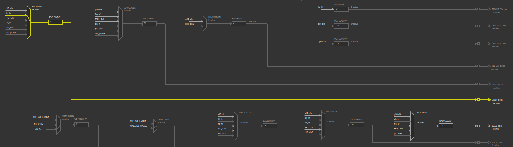 | 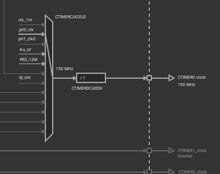 |

### Pines

| Señal | Pin | Función |
| --- | --- | --- |
| Entrada analógica | M4 (PIO1_23) | `ADC1_A23` |
| Salida analógica | T1 (PIO4_2) | `DAC0_OUT` |
| Pulsador SW3 | C14 (PIO0_6) | GPIO0 pin 6, `GPIO00_IRQn` — cambio de frecuencia |
| Pulsador SW2 | B7 (PIO0_23) | GPIO0 pin 23, `GPIO01_IRQn` — RUN/STOP |
| LED RGB | GPIO0 pin 10 (R), GPIO0 pin 27 (G), GPIO1 pin 2 (B) | Indicador de frecuencia |
| UART Debug | LPUART4 | 115200 baud, 8N1, mismo cable USB del debugger |

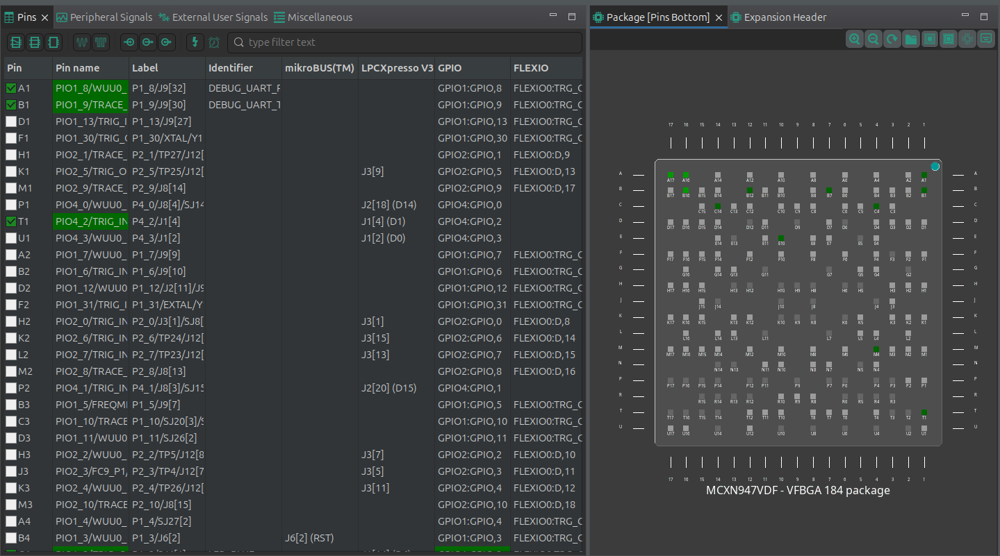

### GPIO — pulsadores

`GPIO0` con dos interrupciones de flanco: `GPIO00_IRQn` (SW3, cambia de frecuencia) y `GPIO01_IRQn` (SW2, alterna RUN/STOP). Ambas se atienden en `MCXN947_Project_TP1.c` y delegan la lógica al módulo `pipeline`.

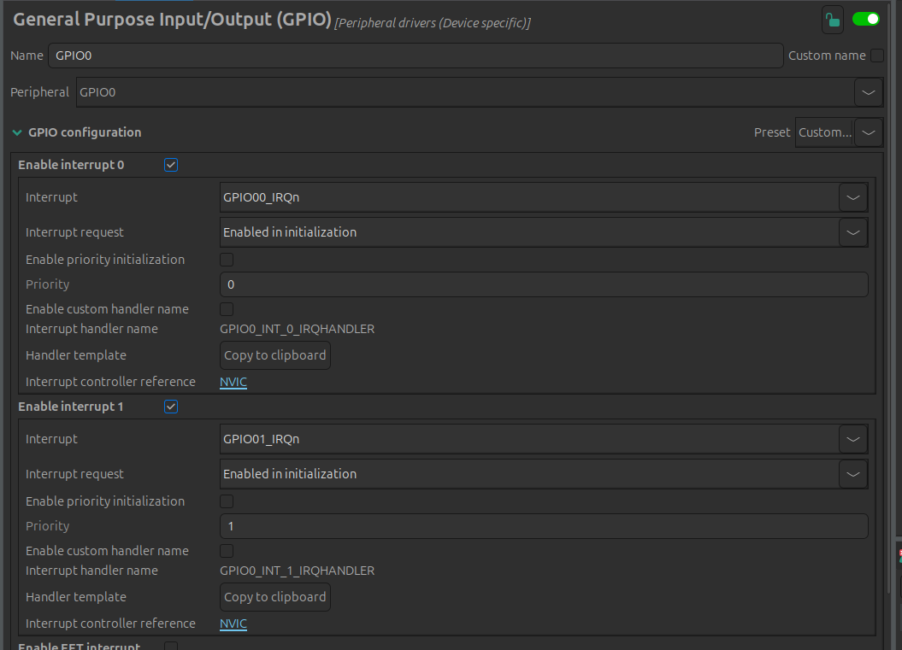

### ADC1 (LPADC)

- Canal de entrada: `A.23`, modo *single-ended*.
- Resolución: **alta (16 bits)**, sin promediado (1 muestra por conversión).
- Tensión de referencia: módulo `VREF0` interno (VREFH).
- Disparo: **por hardware**, desde `CTIMER0`.
- Interrupción: `ADC1_IRQn`, por finalización del disparador 0.

El resultado de cada conversión es un valor de 16 bits sin signo en `[0, 65535]`, que la etapa de adquisición normaliza a Q15 con signo (ver [Código fuente relevante](#código-fuente-relevante)).

| General | Comando de conversión | Disparo e interrupción |
| --- | --- | --- |
| 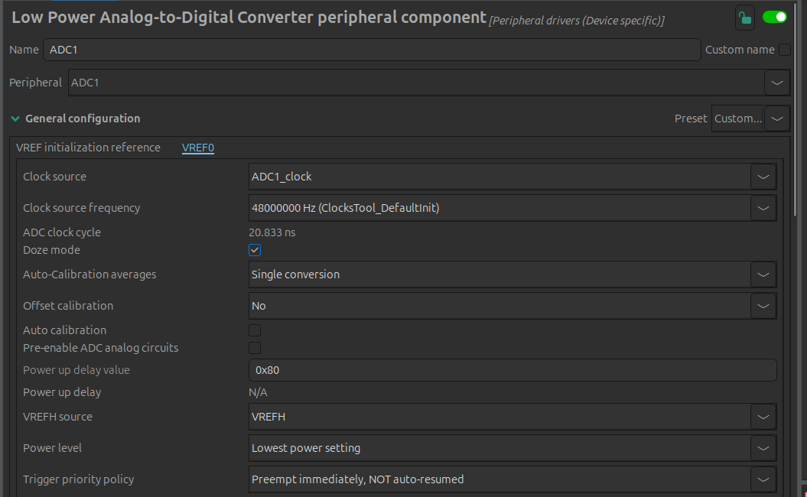 | 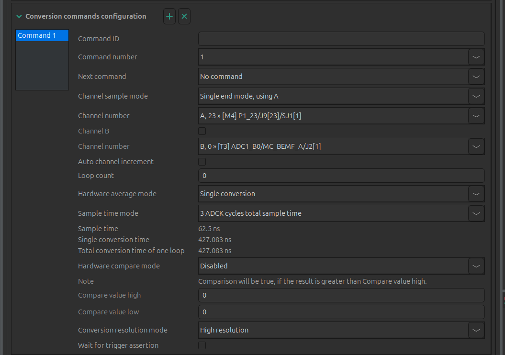 | 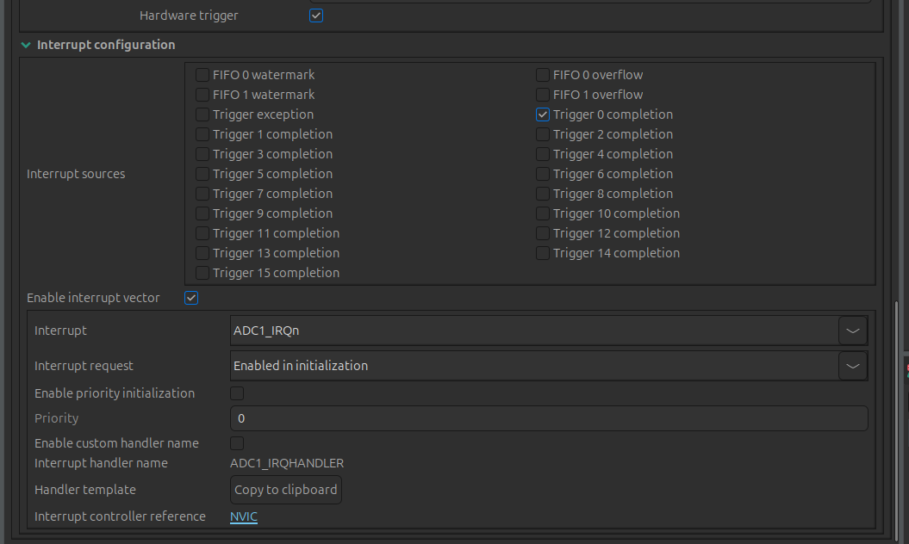 |

### CTIMER0 — generación de la frecuencia de muestreo

`CTIMER0` dispara periódicamente al ADC mediante el canal de *match* 3, en modo **Toggle** con reinicio de contador en cada coincidencia, a 150 MHz sin *prescaler*.

Como el LPADC solo dispara con flanco de **subida**, y en modo *toggle* la mitad de las coincidencias generan flanco de bajada, el valor de *match* se calcula para el **doble** de la frecuencia deseada:

```
matchValue = ceil( f_clk / (2 · f_muestreo) ) − 1,   f_clk = 150 MHz
```

Al cambiar de frecuencia (SW3 o comando UART `f`), `adc_stage_set_sample_rate()` detiene el timer, reprograma el *match* y lo reinicia desde 0, para que no quede "colgado" esperando una coincidencia que ya pasó respecto del nuevo período.

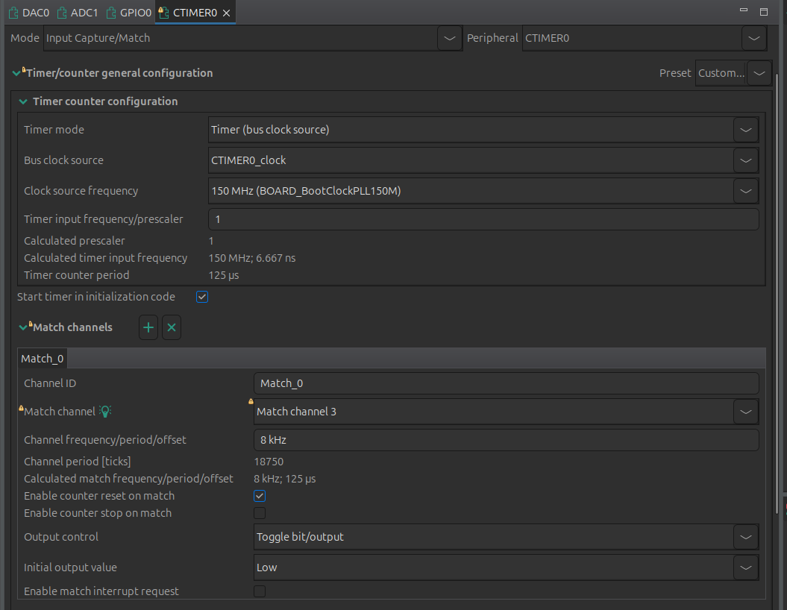

### DAC0

- FIFO deshabilitado: cada escritura en `DATA` pasa directo a conversión.
- **Buffer de salida (opamp buffer) habilitado.**
- Tensión de referencia: VREFH.
- Tiempo de sincronismo: `syncTime = 5` → 6 ciclos de `RCLK` antes del *latch* del dato.

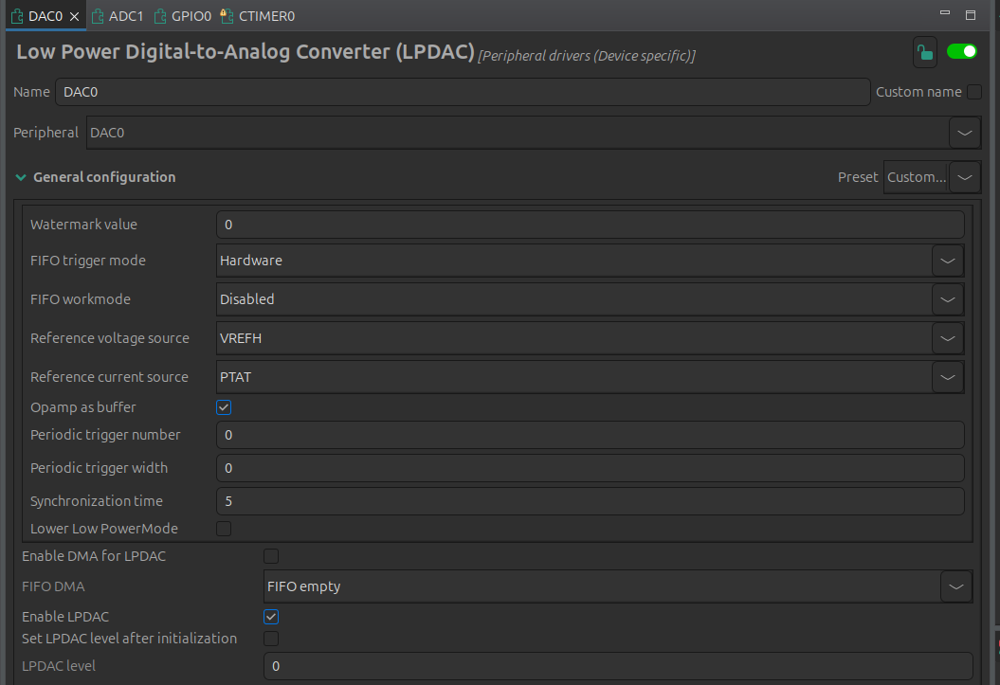

> **Problema encontrado y resuelto — buffer de salida del DAC.** Con el buffer interno deshabilitado, la salida del DAC (de alta impedancia) no lograba excitar correctamente la carga del osciloscopio: la señal reconstruida mostraba una forma de diente de sierra en vez de la senoidal esperada, independientemente de la relación muestras/ciclo (lo que permitió descartar submuestreo y aislar el problema en la configuración analógica). Habilitar el *opamp buffer* lo resolvió — ver comparación en [Demostración y resultados](#demostración-y-resultados).

### UART

Comunicación por **LPUART4** a **115200 baud, 8N1, sin control de flujo**, sobre el mismo cable USB del programador/depurador integrado (MCU-Link), sin hardware adicional.

---

## Diseño de la aplicación

La aplicación se organiza como un *pipeline* desacoplado en etapas, coordinado por el módulo `pipeline`. Cada etapa encapsula un periférico o una responsabilidad concreta y se comunica con las demás solo a través de funciones públicas (sin variables globales compartidas), lo que facilita agregar filtros DSP nuevos en `processing_stage` para los próximos TPs sin tocar el resto del *pipeline*.

### Arquitectura general

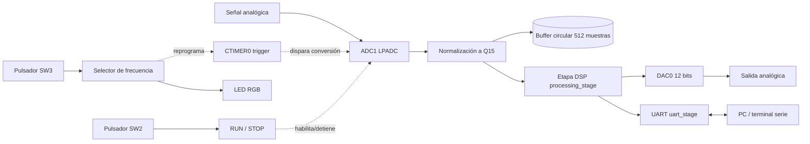
```mermaid
flowchart LR
    SIG[Señal analógica] --> ADC[ADC1 LPADC]
    TIMER[CTIMER0 trigger] -.->|dispara conversión| ADC
    ADC --> Q15[Normalización a Q15]
    Q15 --> BUF[(Buffer circular 512 muestras)]
    Q15 --> DSP[Etapa DSP processing_stage]
    DSP --> DAC[DAC0 12 bits]
    DAC --> OUT[Salida analógica]
    DSP --> UART[UART uart_stage]
    UART <--> PC[PC / terminal serie]

    SW3[Pulsador SW3] --> FREQ[Selector de frecuencia]
    FREQ --> LED[LED RGB]
    FREQ -.->|reprograma| TIMER
    SW2[Pulsador SW2] --> RUNSTOP[RUN / STOP]
    RUNSTOP -.->|habilita/detiene| ADC
```

### Diagrama de secuencia

Secuencia completa de un período de muestreo en modo RUN, desde el disparo del `CTIMER0` hasta la actualización de DAC y UART:

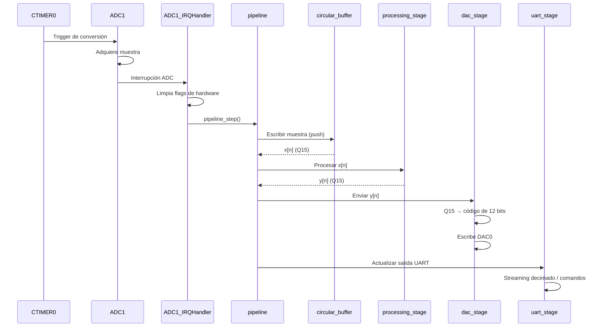
```mermaid
sequenceDiagram
    participant T as CTIMER0
    participant A as ADC1
    participant IRQ as ADC1_IRQHandler
    participant P as pipeline
    participant CB as circular_buffer
    participant DSP as processing_stage
    participant D as dac_stage
    participant U as uart_stage

    T->>A: Trigger de conversión
    A->>A: Adquiere muestra
    A->>IRQ: Interrupción ADC
    IRQ->>IRQ: Limpia flags de hardware
    IRQ->>P: pipeline_step()
    P->>CB: Escribir muestra (push)
    CB-->>P: x[n] (Q15)
    P->>DSP: Procesar x[n]
    DSP-->>P: y[n] (Q15)
    P->>D: Enviar y[n]
    D->>D: Q15 → código de 12 bits
    D->>D: Escribe DAC0
    P->>U: Actualizar salida UART
    U->>U: Streaming decimado / comandos
```

*(Diagrama equivalente al de `assets/sequence-diagram.png`, revisado contra el código actual y llevado a Mermaid para que sea editable como texto.)*

### Módulos del firmware

| Módulo | Responsabilidad |
| --- | --- |
| `pipeline` | Coordina las etapas: `pipeline_step()` (una vez por período de muestreo) y control de alto nivel (RUN/STOP, frecuencia). |
| `adc_stage` | Encapsula LPADC1 + CTIMER0: arranque/parada, cambio de frecuencia, lectura y normalización a Q15. |
| `circular_buffer` | Buffer circular genérico de muestras Q15 (push/pop, reproducción en *loop*, *peek*). Capacidad 512 según consigna. |
| `processing_stage` | Procesamiento DSP muestra a muestra. Modos: *passthrough*, Q15↔float, inversión de fase, ganancia, y un modo `CUSTOM` reservado para TP2/TP3. |
| `dac_stage` | Encapsula el DAC0: conversión de Q15 con signo a código de 12 bits y escritura al periférico. |
| `uart_stage` | Streaming decimado hacia PC (Serial Plotter / Serial-Oscilloscope) y volcado del buffer circular en CSV. |
| `MCXN947_Project_TP1.c` | `main()`, manejadores de interrupción, control del LED RGB y comandos UART. |

### Máquina de estados RUN / STOP

- **RUN**: en cada interrupción del ADC1 se lee la conversión, se guarda en el buffer circular, se procesa y se envía a DAC y UART.
- **STOP**: se detiene la adquisición y el puntero de lectura del buffer circular vuelve al inicio; el *pipeline* sigue corriendo a la misma tasa de muestreo pero reproduciendo en *loop* el contenido congelado del buffer, lo que permite observar los modos de `processing_stage` sobre una señal estática.

El pulsador SW2 (o el comando UART `r`) alterna entre ambos estados.

### Selector de frecuencia y LED RGB

El pulsador SW3 (o el comando UART `f`) avanza cíclicamente 8 → 16 → 22 → 44 → 48 → 8 kS/s y actualiza el LED:

| Frecuencia | R | G | B | Color |
| --- | :-: | :-: | :-: | --- |
| 8 kS/s | ✔ | | | Rojo |
| 16 kS/s | | ✔ | | Verde |
| 22 kS/s | | | ✔ | Azul |
| 44 kS/s | ✔ | ✔ | | Amarillo |
| 48 kS/s | ✔ | | ✔ | Magenta |

### Interfaz de control por UART

Comandos de un solo carácter (sin `Enter`), por el mismo puerto de depuración:

| Tecla | Acción |
| --- | --- |
| `r` | Alternar RUN / STOP |
| `f` | Cambiar frecuencia de muestreo |
| `d` | Volcar las 512 muestras del buffer por UART (CSV) |
| `p` | Activar/desactivar streaming continuo |
| `o` | Alternar formato de streaming (Plotter / Serial-Oscilloscope) |
| `m` | Alternar modo de procesamiento DSP |
| `h` | Mostrar ayuda |

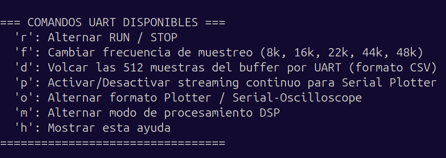

Mientras el streaming está activo no se imprimen mensajes adicionales, para no contaminar el flujo de datos que consume el visualizador en la PC.

---

## Código fuente relevante

El proyecto completo (configuración generada por MCUXpresso + código propio) está en `TP1/MCXN947_Project_TP1/`. Acá solo se muestran los fragmentos centrales de la consigna: la conversión ADC↔Q15↔DAC y la orquestación del *pipeline*.

**Normalización ADC → Q15** (`adc_stage.c`):

```c
q15_t q15_val = (q15_t)((int32_t)s_last_raw - 32768);
// s_last_raw: resultado crudo del LPADC, 16 bits sin signo [0..65535]
// q15_val:    muestra normalizada, Q15 con signo [-32768..32767]
```

**Q15 → código del DAC de 12 bits** (`dac_stage.c`):

```c
void dac_stage_write_sample(q15_t sample) {
    // sample en [-32768, 32767] -> +32768 lleva a [0, 65535] -> >>4 a [0, 4095]
    uint32_t code = LPDAC_DATA_DATA(((int32_t)sample + 32768) >> 4);
    DAC_SetData(DAC0_PERIPHERAL, code);
}
```

**Valores de *match* de CTIMER0 por frecuencia** (`adc_stage.c`), calculados para el doble de cada frecuencia por el motivo explicado en [CTIMER0](#ctimer0--generación-de-la-frecuencia-de-muestreo):

```c
static const uint32_t s_match_values[SAMPLE_RATE_COUNT] = {
    [SAMPLE_RATE_8K]  = 9374,  // 8 kHz
    [SAMPLE_RATE_16K] = 4686,  // 16 kHz
    [SAMPLE_RATE_22K] = 3408,  // 22 kHz
    [SAMPLE_RATE_44K] = 1704,  // 44 kHz
    [SAMPLE_RATE_48K] = 1562,  // 48 kHz
};
```

**Orquestación de un período de muestreo** (`pipeline.c`, invocada desde `ADC1_IRQHandler`):

```c
void pipeline_step(void) {
    q15_t in_sample = 0, out_sample = 0;

    if (adc_stage_is_running()) {                  // Modo RUN
        if (adc_stage_read_sample(&in_sample)) {
            out_sample = processing_stage_process_sample(in_sample);
            dac_stage_write_sample(out_sample);
            uart_stage_feed_sample(in_sample, out_sample);
        }
    } else {                                        // Modo STOP: reproduce el buffer en loop
        in_sample = circular_buffer_get_playback_sample(&s_circ_buffer);
        out_sample = processing_stage_process_sample(in_sample);
        dac_stage_write_sample(out_sample);
        uart_stage_feed_sample(in_sample, out_sample);
    }
}
```

---

## Demostración y resultados

### Consola UART

Arranque, streaming en vivo y notificación de la frecuencia activa:

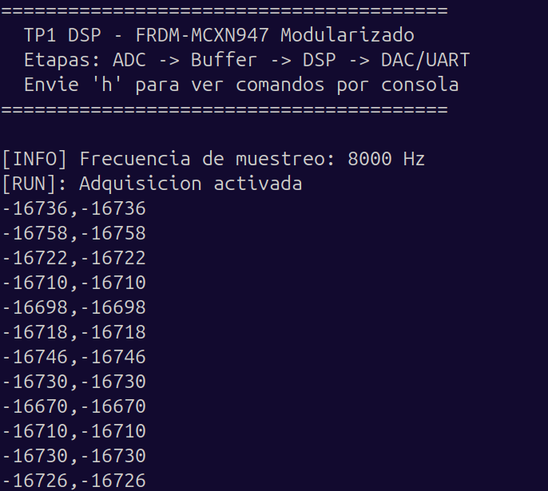

Cambio de frecuencia (16k → 22k → 44k) y transición a STOP:

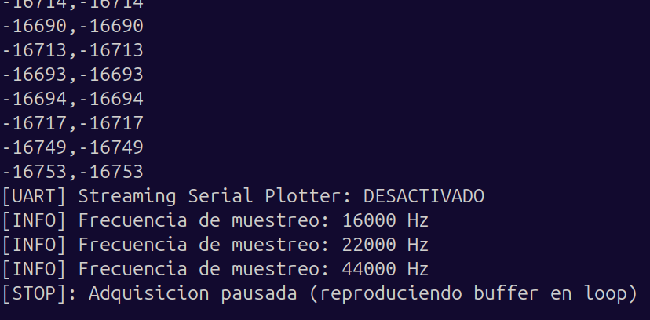

Volcado del buffer circular completo (comando `d`, 512 muestras en CSV):

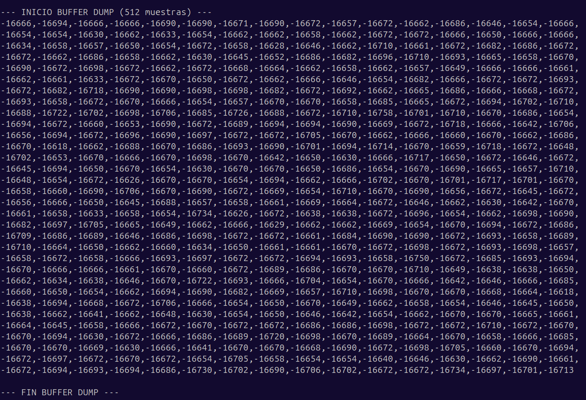

### Bug del buffer de salida del DAC: antes y después

**Antes** (`enableOpampBuffer = false`): entrada ADC limpia (amarillo) vs. salida DAC en diente de sierra (celeste), independiente de la relación muestras/ciclo:

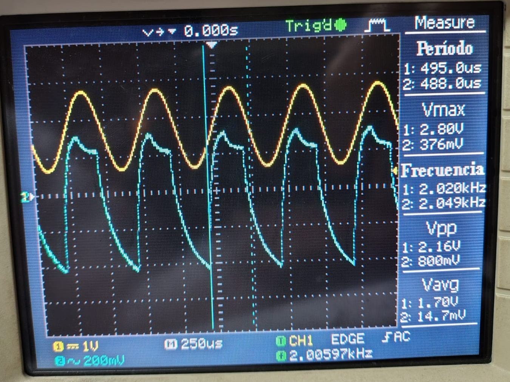

**Después** (`enableOpampBuffer = true`), 1 kS de entrada muestreado a 8 kS/s — se ve la reconstrucción *zero-order-hold* correcta (8 muestras/ciclo), sin el artefacto de diente de sierra:

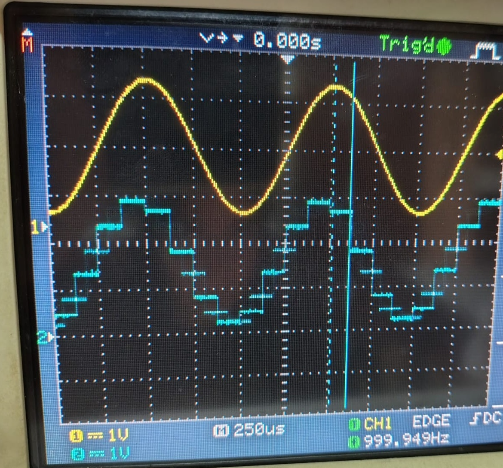

### Relación muestras por ciclo y aliasing

Con la frecuencia de muestreo fija en 8 kS/s, se varió la frecuencia de entrada para verificar el límite de Nyquist:

| 1 kHz de entrada (8 muestras/ciclo) | 4 kHz de entrada (2 muestras/ciclo, límite de Nyquist) | 5 kHz de entrada (< 2 muestras/ciclo, aliasing) |
| --- | --- | --- |
|  | 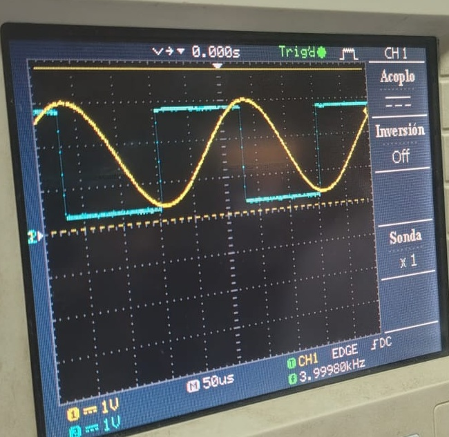 | 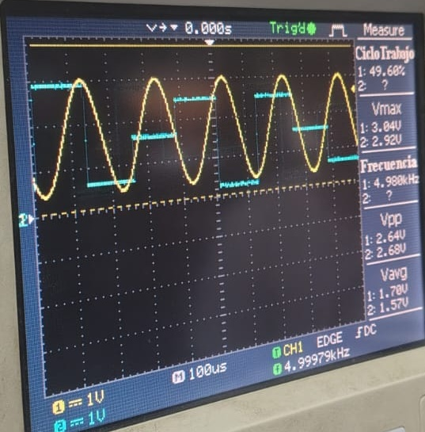 |

Con 5 kHz de entrada se viola el criterio de Nyquist para 8 kS/s (`f_s < 2 * f_in`) y la salida del DAC deja de representar la senoidal de entrada, como se espera.

### Espectro (FFT) a 48 kS/s

Entrada de 10 kHz muestreada a 48 kS/s: el espectro muestra un único pico limpio en ~10 kHz, sin *aliasing* (se cumple ampliamente Nyquist):

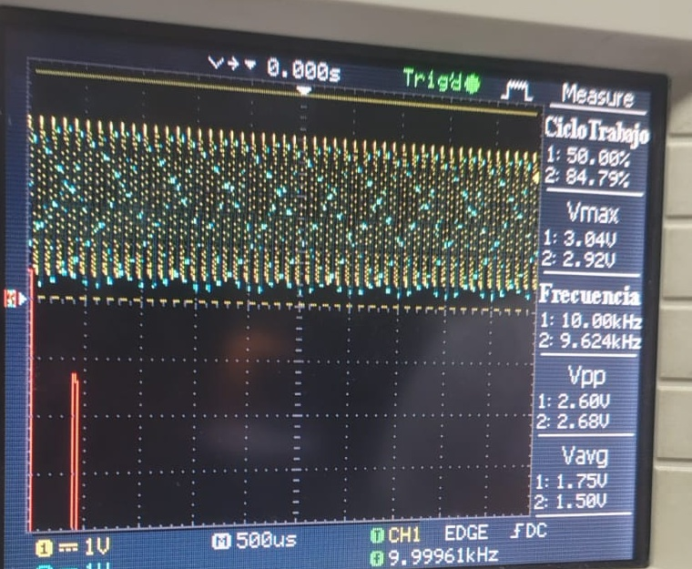

### Muestreo a 48 kS/s (1 kHz de entrada)

Con la relación muestras/ciclo más alta soportada (48 muestras por cada ciclo de 1 kHz), la salida del DAC sigue la entrada casi sin distinguirse de ella, sin el escalón *zero-order-hold* visible a 8 kS/s:

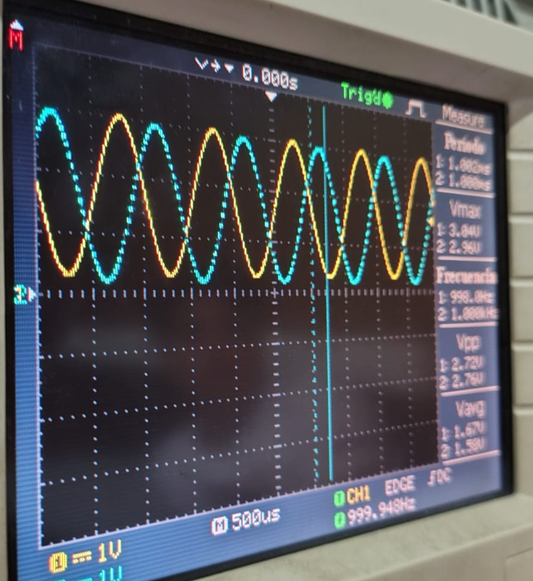

### Video de demostración

Corrida completa del programa (adquisición, RUN/STOP, cambio de frecuencia con indicación por LED, y salida por DAC): [ver video en Google Drive](https://drive.google.com/file/d/1Bdo-6WuZkyrO01PfuTy0t6_2FUu6QV0r/view?usp=sharing).

---

## Conclusiones

Se implementó y verificó una aplicación completa de adquisición y reproducción de señal sobre la FRDM-MCXN947, cumpliendo la consigna: cinco frecuencias de muestreo seleccionables por pulsador con indicación en el LED RGB, control RUN/STOP, almacenamiento en un buffer circular de 512 muestras en Q15 y salida por el DAC de 12 bits.

La organización en etapas desacopladas (`adc_stage`, `processing_stage`, `dac_stage`, `uart_stage`, coordinadas por `pipeline`) permitió aislar y resolver de forma sistemática el problema real encontrado durante la puesta a punto — la forma de onda distorsionada a la salida del DAC por tener deshabilitado su buffer de salida — y deja una base ordenada para incorporar los filtros digitales de los próximos TPs en `processing_stage` sin modificar el resto del *pipeline*.
