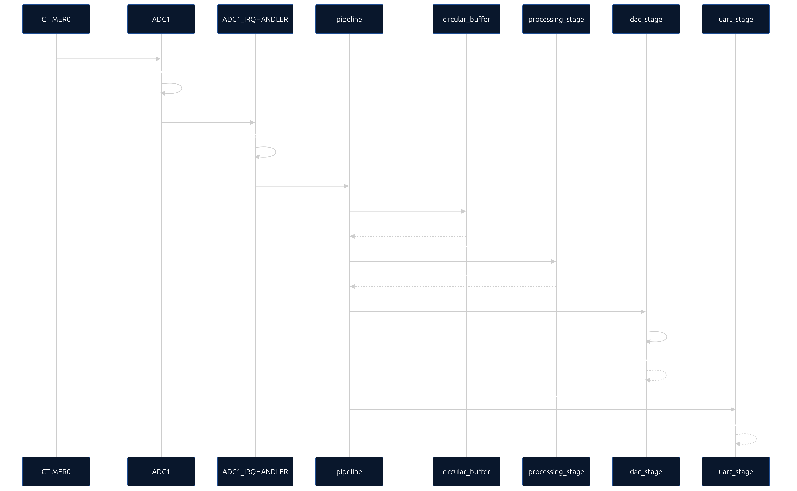

  

# TP1 — Muestreo con MCXN947

|              |                                  |
|--------------|----------------------------------|
| **Materia:** | Procesamiento Digital de Señales |
| **Carrera:** | Ingeniería en Computación        |
| **Alumnos:** | García, Lautaro Misael           |
|              | Molina, María Wanda              |
|              | Renaudo Gaggioli, Valentino      |
|              | Verdú, Melisa Noel               |
| **Fecha:**   | Septiembre, 2026                 |

---

## Diagrama de Secuencia
